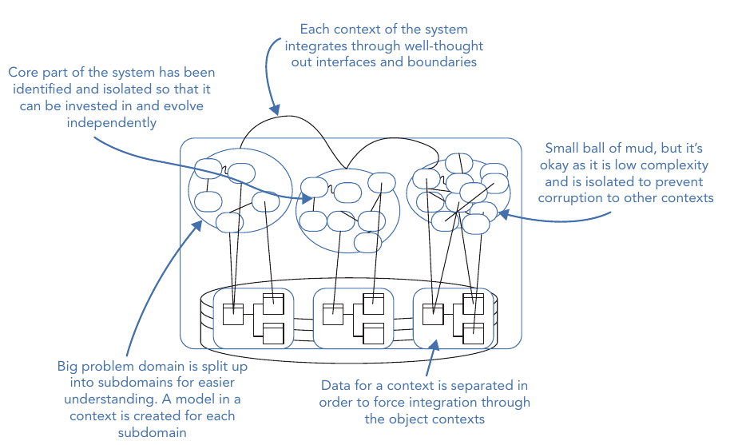
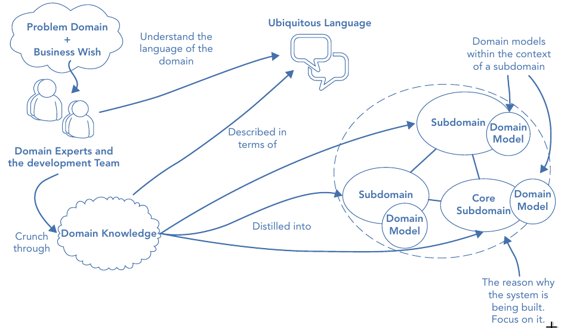
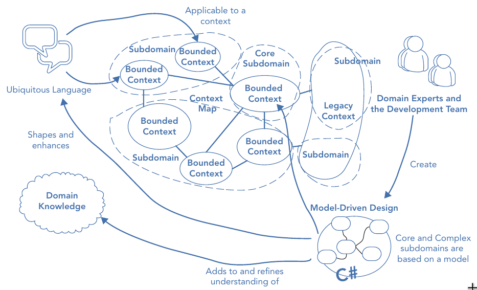

# Chapter 01. What Is Domain‐Driven Design

## Overview

- An introduction to the philosophy of Domain‐Driven Design
- The challenges of writing software for complex problem domains
- How Domain‐Driven Design manages complexity
- How Domain‐Driven Design applies to both the problem and solution space
- The strategic and tactical patterns of Domain‐Driven Design
- The practices and principles of Domain‐Driven Design
- The misconceptions of Domain‐Driven Design

> Domain‐Driven Design (DDD) is a development philosophy defined by Eric Evans in his seminal work [Domain‐Driven Design: Tackling Complexity in the Heart of Software (Addison‐Wesley Professional, 2003)](https://www.amazon.com/Domain-Driven-Design-Tackling-Complexity-Software/dp/0321125215/ref=sr_1_fkmrnull_1?keywords=Domain%E2%80%90Driven+Design%3A+Tackling+Complexity+in+the+Heart+of+Software&qid=1551699617&s=gateway&sr=8-1-fkmrnull)

## The Challenges of Creating Software for Complex Problem Domains

- By far, the most popular software architectural design pattern for business applications is **the Big Ball of Mud (BBoM) pattern**
  - Foote and Yoder use the term BBoM to describe an application that appears to have no distinguishable architecture
  - Eric Evans describes such systems as containing "code that does something useful, but without explaining how"
- One of the main reasons software becomes complex and difficult to manage is due to **the mixing of domain complexities with technical complexities**

### Code Created Without a Common Language

- A lack of focus on a shared language and knowledge of the problem domain results in a codebase that
  - works but does not reveal the intent of the business
  - difficult to read and maintain because translations between the analysis model and the code model can be costly and error prone

> An analysis model is used to describe the logical design and structure of a software application.

### A Lack of Organization

- The codebase of a BBoM lacks the required synergy with the business behavior to make change manageable

### The Ball of Mud Pattern Stifles Development

- Bug stems from the uninterlligent messy codebase
- Complain about the difficulty of working in such a message will go up over time
- Even more resources cannot increase velocity to satisfy the business
- Finally, exasperated by the situation, the request for the dreaded application rewrite is granted

### A Lack of Focus on the Problem Domain

- Typing is not the bottleneck for delivering a product
- Coding is the easy part of development
- **Outside of non‐functional requirements creating and keeping a useful software model of the domain that can fulfill business-use cases is the difficult part**

> A problem domain refers to the subject area for which you are building software. Experts in the problem domain work with the development team to focus on the areas of the domain that are useful to be able to produce valuable software

## How the Patterns of Domain‐Driven Design Manage Complexity

- Tools
  - Strategic patterns
  - Tactical patterns

### The Strategic Patterns of DDD

- Functions
  - distil the problem domain
  - shape the architecture of an application

#### Distilling the Problem Domain to Reveal What Is Important

- Development teams and domain experts use analysis patterns and knowledge crunching to distill large problem domains into more manageable subdomains
- **WHY**
  - The core domain is the driving force behind the product under development
  - It is the fundamental reason it is being built
  - DDD emphasizes the need to focus effort and talent on the core subdomain(s) as this is the area that
    - holds the most value
    - is key to the success of the application
- This clarity on where to focus effort can also empower teams to look for open source off‐the‐shelf solutions for some of the less important parts of a system
- Discovering the core domain helps teams understand
  - why they're producing the software, and
  - what it means for the software to be successful to the business
  - they should make products adaptable to the evolution of the business

#### Creating a Model to Solve Domain Problems

- In the solution space a software model is built for each subdomain to
  - handle domain problems, and
  - align the software with the business contours
    > To avoid accidental technical complexity the model is kept isolated from infrastructure code
- **All models are not created equal**; the most appropriate design patterns are used based on the complexity needs of each subdomain rather than applying a blanket design to the whole system

#### Using a Shared Language to Enable Modeling Collaboration

- Models are built through the collaboration of domain experts and the development team.
- Communication is achieved using an ever‐evolving shared language known as the ubiquitous language (UL) to efficiently and effectively connect a **software model** to a **conceptual analysis model**
  > - Concepts, and terms that are discovered at a coding level are replicated in the UL and therefore the analytical model
  > - When the business reveals hidden concepts at the analysis model level this insight is fed back into the code model

#### Isolate Models from Ambiguity and Corruption

- Models sit within a bounded context
  - defines the applicability of the model
  - ensures that its integrity is retained
- **Bounded contexts** are used to form a protective boundary around models that helps to prevent software from evolving into a BBoM

  > Models are isolated from infrastructure code to avoid the accidental complexity of merging technical and business concepts

- Applying the strategic patterns of Domain‐Driven Design is depicted as
  

> Applicability of the BBoM
>
> - When: feedback and first‐to‐market are core to the success of a product
> - How: define a context around the bounded contexts that use the BBoM to avoid them corrupting the core subcomain

#### Understanding the Relationships between Contexts

- Context maps reveal
  - how different models interact
  - what data they exchange to fulfill business processes
- Useful for
  - helping you to understand the bigger picture
  - enabling teams to understand
    - what models exist, what they are responsible for
    - where their applicability boundaries are.

### The Tactical Patterns of DDD

- **DEFINITION**: a.k.a., model building blocks, are a collection of patterns that help to create effective models for complex bounded contexts

### The Problem Space and the Solution Space

- The problem space distils the problem domain into more manageable subdomains
  
- DDD's impact in the problem space is to reveal

  - what is important
  - where to focus effort

- The solution side of DDD covers patterns that

  - can shape the architecture of your applications
  - make it easier to manage

  

## The Practices and Principles of Domain‐Driven Design

### Focusing on the Core Domain

**WHY**

- The core subdomain is
  - The area of your product that will be the difference between it being a success and it being a failure
  - The product's unique selling point
  - The reason it is being built rather than bought
- The core domain is
  - The area of the product that
    - will give you a competitive advantage
    - generate real value for your business

### Learning through Collaboration

- Collaboration between the development teams and business experts to produce useful models to solve problems

### Creating Models through Exploration and Experimentation

- A breakthrough in the analysis model (by the domain expert) results in a change to the code model
- A refactoring in the code model (by developers) that reveals deeper insight is again reflected in the analysis model and mental models of the business

### Communication

- The ability to effectively describe a model built to represent a problem domain is the foundation of DDD
- Analysis and mental models produced in knowledge‐crunching sessions between the teams need a shared language to bind them to a technical implementation

### Understanding the Applicability of a Model

- **PROBLEM**: Different parts of an organization having different understandings of a common term or concept
- Each context defines a **linguistic boundary**; ensuring models are understood in a specific context to avoid ambiguity in language
- A model with overlapping terms is divided into two models, each clearly defined within its own context.

### Constantly Evolving the Model

- DDD challenges the team to evolve and simplify complex models of domains as and when it gains domain insights

## Popular Misconceptions of Domain‐Driven Design

- DDD is not a strict methodology in itself but must be used with some form of iterative software project methodology to build and evolve a useful mode

### Tactical Patterns Are Key to DDD

- DDD is less about software design patterns and more about problem solving through collaboration
- Software is merely an artifact of DDD

### DDD Is a Framework

- DDD is architecturally agnostic in that there is no single architectural style you must follow to implement it

### DDD Is a Silver Bullet
