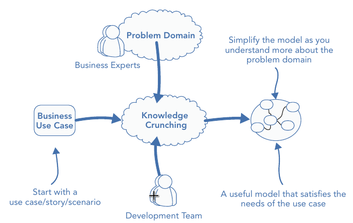
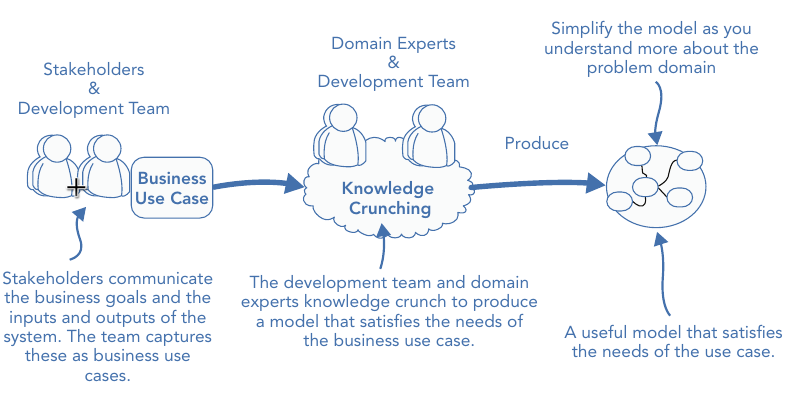
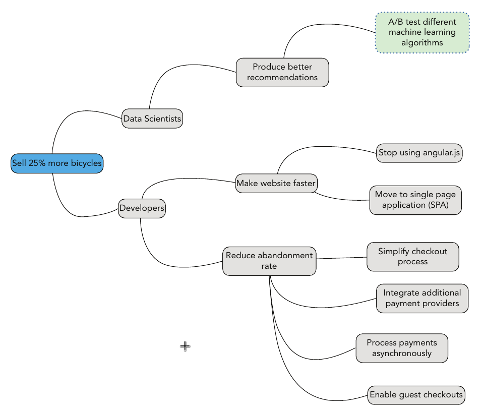
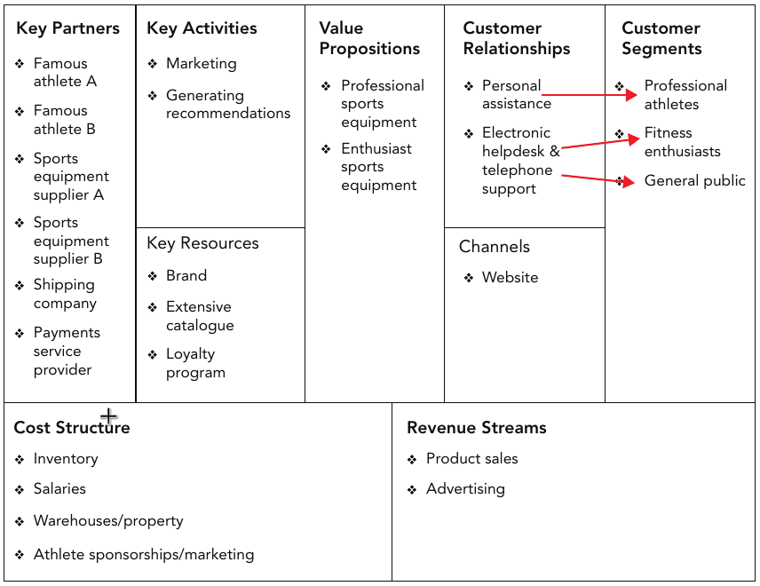

# Distilling the Problem Domain

## Overview

- The need for knowledge crunching
- How collaboration can foster a shared understanding and a shared language
- What a domain expert is and why the role is essential
- Effective methods for gaining domain knowledge

## Knowledge Crunching and Collaboration

- Knowledge crunching is key to bridging any knowledge gaps for the technical team when designing a solution for a problem domain based on a set of requirements
- Knowledge gathering occurs on whiteboards, working through examples with business experts and generally brainstorming together
- The process of knowledge crunching

  1. Starts with the behaviors of a system
  2. The team go through the scenarios of the application with the business stakeholders and experts

  

### Reaching a Shared Understanding through a Shared Language

- An output of knowledge crunching and an artifact of the shared understanding is a common Ubiquitous Language (UL)
- When modeling with stakeholders and subject matter experts everyone should make a conscious effort to consistently apply a shared language rich in domain-specific terminology
- This language must be made explicit and be used when describing the domain model and problem domain
- The language should also be used in the code implementation of the model, with the same terms and concepts used as class names, properties, and method names
- UL is used to bind the code representation of the model to the conceptual model communicated in language and diagrams, which the business can understand.

### The Importance of Domain Knowledge

- The insight of the domain knowledge will enable teams to focus on the salient points and create a model at the heart of their application's code base that can fulfill the business use cases and keep doing so over the lifetime of the application
- If you can't speak to your business users in simple terms about complex concepts in the problem domain, you are not ready to start developing software within it

### The Role of Business Analysts

- Help stakeholders flesh out their initial ideas and capture inputs and outputs of the product
- Facilitators the communication between developers and domain experts

### An Ongoing Process

- Teams should continually be working toward a simple view of the problem domain that focuses only on the relevant pieces to aid the creation of a useful model
- Knowledge crunching should be an ongoing concern with the business engaged throughout the lifetime of the application build
- With each iteration of the system the model will evolve
- A good model is one that is supple to change; a mature model holds rich and expressive concepts and terminology of the problem domain and is understood by both the business and technical teams

## Gaining Domain Insight with Domain Experts

- **WHY**: The domain experts are the people who deeply understand the business domain from its policies and work flows, to its nuisances and idiosyncrasies

### Domain Experts vs Stakeholders

- Stakeholders provide a set requirements, inputs and expected outputs of the problem space
- Domain experts help to shape the solution space with a model meeting the requirements

  

### Deeper Understanding for the Business

- **WHY**
  - Enable developers to gain knowledge about the problem domain
  - Help domain experts to qualify her understanding of the domain

### Engaging with Your Domain Experts

- It is recommended that you collocate the development team with domain experts who will be on hand to answer questions and participate during analysis at impromptu corridor or break room meetings
- Spend as much time as you can with her, and learn as much as possible

  > **MAKE THE MOST OF YOUR DOMAIN EXPERT; YOU NEVER KNOW WHEN SHE WILL BE GONE**: A domain expert's time will be precious; meeting her halfway and showing a genuine interest will display to her that there is value in sharing knowledge

## Patterns for Effective Knowledge Crunching

### Focus on the Most Interesting Conversations

- Start with the areas of the problem domain that keep the business up at night -- the areas that will make a difference to the business and that are core for the application to be a success
- It's often a good idea to follow the money and look for the areas that are costing the business money or preventing them from increasing revenue

### Start from the Use Cases

- A use case lists the steps required to achieve a goal, including the interactions between users and systems
- Capture a process map of reality, understand the work flow as it is, and don't try to jump to a solution too quickly before you truly understand and appreciate the problem

### Ask Powerful Questions

- Some examples
  - Where does the need of this system come from
  - How will this system give value to the business
  - What would happen if this system wasn't built

> A blog post http://goodenoughsoftware.net/2012/02/29/powerful‐questions/

### Sketching

- One basic principle: keep your diagrams at a consistent level of detai
- It's often better to create multiple diagrams each at a different level of detail
- UML maybe too formal for rapid knowledge-crunching sessions, as the team will need to retry and model many times
- Packages such as Visio or Rational Rose to capture a moving model is time consuming

### Class Responsibility Collaboration (CRC) Cards

- Three areas as
  - A class name, which represents a concept in the domain
  - The responsibilities of the class
  - Classes that are associated and are required to fulfill its purpose

### Defer the Naming of Concepts in Your Model

- Instead of giving areas or concepts of the model real names, use gibberish until you have understood all the responsibilities, behavior, and data of a concern
- The types of names that you want to avoid are `XXXXService` and `XXXXManager`. For such cases, strive fro the real intent behind the name

### Behavior‐Driven Development (BDD)

- BDD, based on Test‐Driven Development (TDD), which focuses on capturing the behavior of a system and then driving design from the outside in
- Comparison between BDD and DDD
  - BDD focuses on the software behavior, how the system should behave
  - DDD focuses on the domain model at the heart of the software that is used to fulfil the behaviors--a small but important distinction
- BDD has its own form of UL to specify requirements—an analysis language, if you will, known as **GWT** (Given, When, Then)
- In GWT
  - A feature describes a behavior that gives value to the business
  - In a feature story, a role and benefit are also included
  - An example goes as
    - a feature for an e‐commerce site
      ```
      Feature: Free Delivery for Large Orders
      ```
    - An story for this feature
      ```
      In order to increase the average order total, which is $50,
      As the marketing manager
      I would like to offer free delivery if customers spend $60.
      ```
- BDD scenarios
  - Describe the feature/requirements under different use cases
  - Start with an initial condition, the `Given`s
  - Then contain one or more events, the `When`s,
  - Then describe the expected outcomes, the `Then`s
  - An example goes as
    ```
     Scenario: Customer satisfies the spend threshold for free delivery
        Given: Threshold for free delivery is set at $60
          And: I am a customer who has a basket totaling $50
         When: I add an item to my basket costing $11
         Then: I should be offered free delivery
    ```
  - Provide acceptance criteria that developers and testers can use to determine when a feature is complete, and business users can use to confirm that the team understands the feature

### Rapid Prototyping

- 2 Options
  - Screen mock-ups
    - **WHY**: Users understand UI; they can interact with it and act out work flows clearly
  - Capture requirements in throw-away code
    - **WHY**
      - Starting to implement abstract ideas from knowledge crunching will enable you to validate and prove your model
      - Helps to avoid only abstract thinking, which can lead to analysis paralysis
      - Coding quickly helps create your powerful questions and helps find missing use cases
    - **HOW**
      - Only create a code model of what is relevant and within the specific context to solve a given problem
      - Think small and model around rules; then build up

### Look at Paper‐Based Systems

- **WHEN**: A problem domain that does not have an existing software solution
- Rare edge-case scenarios may be better solved by handing power back to the manual process

## Look For Existing Models

- A domain known for long may follow a known model
- **HOW**: Seek out information that teaches you more about the domain, and follow the pattern
- TIP: you are only as good as your weakest developer; this applies to domain knowledge as much as technical expertise

### Understanding Intent

- **WHY**
  - Customers will often given you requirements based on the constraints of the current systems rather than what they really desire
  - Business users may not be able to write effective features or effectively express goals
- **HOW**
  - Share and understand the underlying vision
  - Be aware of what the business is trying to achieve

### Event Storming

- **HOW**: Groups of domain experts, the ones with the answers, and development team members, the ones with the questions, work together to build a shared understanding of the problem domain
- The problem domain is explored by **starting with a domain event**; i.e., events that occur within the problem domain that the business cares about
- Backtrack the triggers of the events until all conditions for the trigger has been cleared

### Impact Mapping

- **WHY**: Better questions based on the goal during knowledge-crunching sessions
- An impact map
  - Starts with the **impact**
  - Directly connected to the impact are the **actors** -- the people who can contribute to making the desired impact
  - **Child** nodes of the actors are the ways in which the actors can help
  - The last level of the hierarchy shows the actual tasks that can be carried out
- An example goes as
  

### Understanding the Business Model

- **WHY**: A business model contains lots of useful domain information and accentuates the fundamental goals of a business
- One of the best ways to learn about a company's business model is to visualize it using a **Business Model Canvas**
- A business model canvas is broken into 9 building blocks, and examplified as
  

  |                  Block | Description                                                                                                                                                   |
  | ---------------------: | :------------------------------------------------------------------------------------------------------------------------------------------------------------ |
  |      Customer Segments | the different types of customers a business targets. Examples include niche markets, mass markets, and business‐to‐business (b2b)                             |
  |     Value Propositions | the products or services a business offers to its customers. Examples include physical goods and cloud hosting                                                |
  |               Channels | how the business delivers its products or services to customers. Examples include physical shipping and a website                                             |
  | Customer Relationships | the types of relationships the business has with each customer segment. Examples include direct personal assistance and automated electronic help facilities. |
  |        Revenue Streams | the different ways the business makes money. Examples include advertising revenue and recurring subscription fees                                             |
  |          Key Resources | a business's most important assets. Examples include intellectual property and important employees                                                            |
  |         Key Activities | the activities fundamental to making the business work. Examples include developing software and analyzing data                                               |
  |       Key Partnerships | a list of the business’s most significant partners. Examples include suppliers and consultants                                                                |
  |         Cost Structure | the costs that the business incurs. Examples include salaries, software subscriptions, and inventory                                                          |

### Deliberate Discovery

- At the start of a project teams should make a concerted effort to identify areas of the problem domain that they are most ignorant of to ensure that these are tackled during knowledge-crunching sessions

### Model Exploration Whirlpool

- **WHEN**: Modeling encounters problems, such as
  - Breakdowns in communication with the business
  - Overly complex solution designs
  - There is a complete lack of domain knowledge
- **HOW**
  - Scenario Exploring
    - A domain expert describes a scenario that the team is worried about or having difficulty with in the problem domain
    - A scenario is a sequence of steps or processes that is important to the domain expert, is core to the application, and that is within the scope of the project
  - Modeling
  - Challenging the Model
  - Harvesting and Documenting
    - Significant scenarios that help demonstrate the model should be captured in documentation
    - Key scenarios will form the reference scenarios, which will demonstrate how the model solves key problems within the problem domain
  - Code probing
