# Chapter 08. Application Architecture

## Overview

- Application architecture patterns that protect the integrity of your domain model
- The difference between application and bounded context architectures
- The role and responsibilities of application services
- How to support various application clients

## APPLICATION ARCHITECTURE

the architecture must support the isolation of the domain logic

### Separating the Concerns of Your Application

- implementation: separate of technical complexities from the complexities of the domain
- reason: accommodate change without causing an undesired effect to unrelated areas of the codebase

### Abstraction from the Complexities of the Domain

expose a coarse-grained set of use cases that encapsulate and hide the low-level domain details

### A Layered Architecture

- examples of separation of concerns by dividing an application into areas that change together
  - Uncle Bob's Clean Architecture
  - the Hexagonal Messaging Architecture (also known as the Ports and Adapters Architecture)
  - the Onion Architecture

a layered architecture goes as  
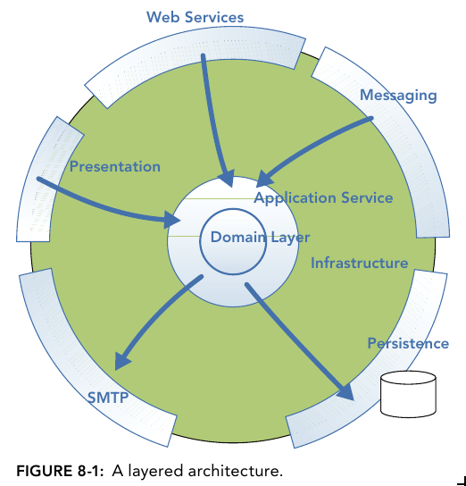

### Dependency Inversion

- All dependencies face inward
- The domain layer, at the heart of the application, depends on nothing else, enabling it to focus distraction-free on domain concerns
- The application layer
  - depends only on the domain layer
  - orchestrates the handling of the use cases by delegating to the domain layer
- Implementation

  - the application layer defines an interface that enables domain objects to be hydrated and persisted
  - The infrastructural layers then implement and adapt to these interfaces, thus giving the dependency that the lower layers need without coupling

    > Transaction management along with cross-cutting concerns such as security and logging are provided in the same manner.

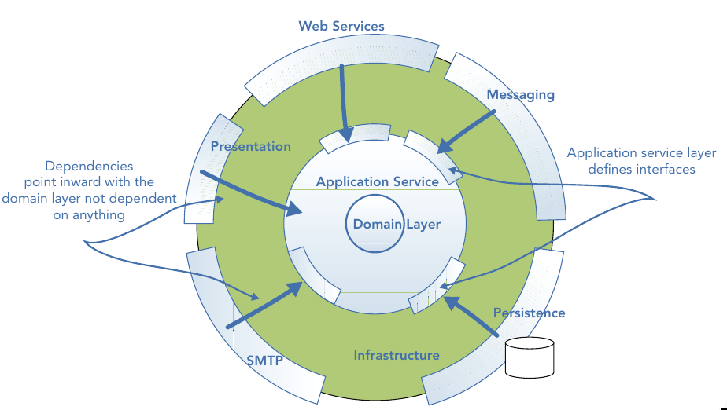

### The Domain Layer

- A domain model represents **a conceptual abstract view of the problem domain** created to fulfill the needs of the business use cases
- The domain layer containing the abstract model
  - depends on nothing else
  - is agnostic to
    - the technicalities of the clients it serves and
    - stores that persist the domain objects

### The Application Service Layer

- The application service layer represents **the use cases and behavior of the application**
- **Use cases** are implemented as application services that contain application logic to coordinate the fulfillment of a use case by delegating to the domain and infrastructural layers
- Application services operate at a higher level of abstraction than the domain objects, exposing a coarse-grained set of services while hiding the details of the domain layer
- **Benefit of encapsulating the domain**: the domain model can be evolved without affecting clients
- The application service layer is the client of the domain layer
- The application layer implements **Dependency Inversion** principle
- The responsibility of the application service layer
  - coordinating the retrieval of domain objects from a data store
  - delegating work to them
  - saving the updated state
  - coordinating event notifications to other systems
- New clients must
  - adapt to the input defined by the application's API
  - transform the output of the application service into a format that is suitable for them

> The application layer works as an anticorruption layer

### The Infrastructural Layers

The infrastructural layers are concerned with purely technical capabilities, such as

- enabling the application to be consumed
  - by humans via a user interface, or
  - by applications via a set of web service or message endpoints
- technical CRUD implementation of domain objects
- logging
- security, notification
- integration with other bounded contexts and applications

### Communication Across Layers

- don't pass domain objects across boundaries
- communicate changes or actions in the domain in form of
  - simple data transfer objects (DTOs)
  - presentation models
  - application events
- To avoid tight coupling of layers, higher layers must communicate with lower layers by adapting to their message types

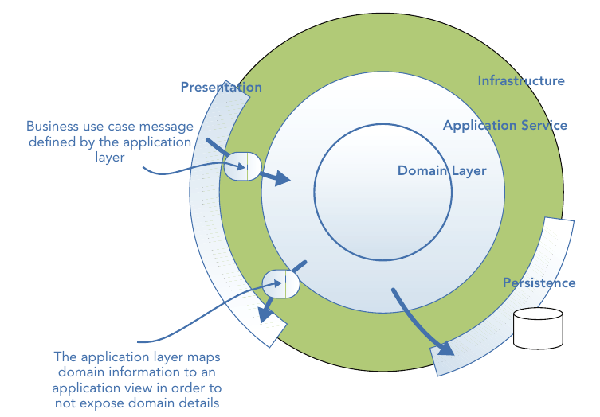

### Testing in Isolation

- for the domain layer: use unit tests to confirm the logic
- for the application layer: fake implementations by mocking and stubbing to confirm the correctness of business task coordination with the domain layer and external resources

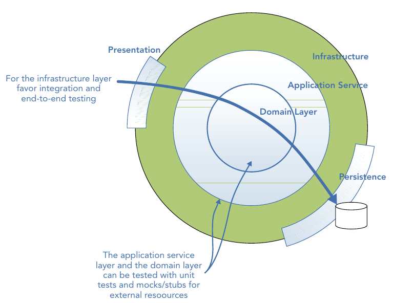

### Don't Share Data Schema between Bounded Contexts

- Why
  - easy for client code to bypass the protection of a bounded context and interact with a domain object state without the protection of domain logic
  - easy to interpret logic and schema incorrectly, resulting in changes to the state that invalidate invariants
- should favor application or bounded context databases over integration databases

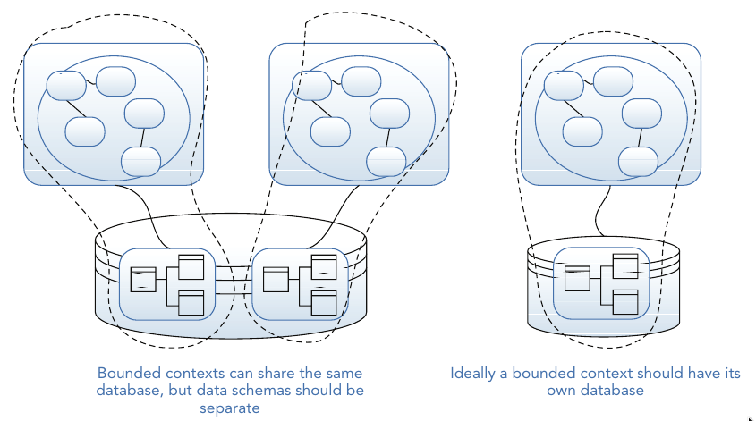

### Application Architectures versus Architectures for Bounded Contexts

- **Applications can be composed of more than one bounded context**

  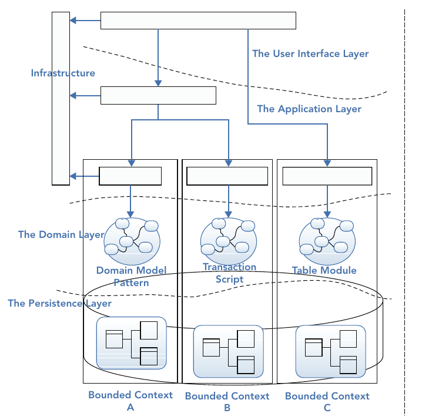

- Architectures apply to bounded contexts and applications in different ways
- some people believe that the boundary of a bounded context should extend to the presentation layer

  - the infrastructure takes care of ensuring communication and the sharing of correlation IDs

  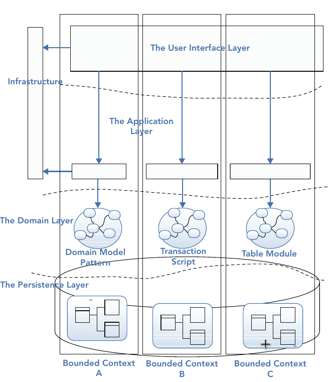

## APPLICATION SERVICES

- The application services
  - define the boundary of your domain model
  - can also be thought of as **the implementation of the bounded context concept**
  - isolate and protect the integrity of your domain model
- Application services
  - contain application logic only, covering
    - security
    - transaction management
    - communication with other technical capabilities such as e-mail and web services
  - should have no domain logic
  - **should be procedural in style and thin**

### Application Logic versus Domain Logic

- Application logic contains the workflow steps required to fulfill a business use case
  - Steps include
    - hydrating domain objects from a database
    - mapping user input to objects that the domain layer understands
    - delegating to domain objects or a collection of them to make a business decision
    - delegating to infrastructural services
- Application logic is all about coordination and orchestration through delegation to domain and infrastructural services
- An example of modeling the use case of applying a promotion coupon to an e-commerce basket

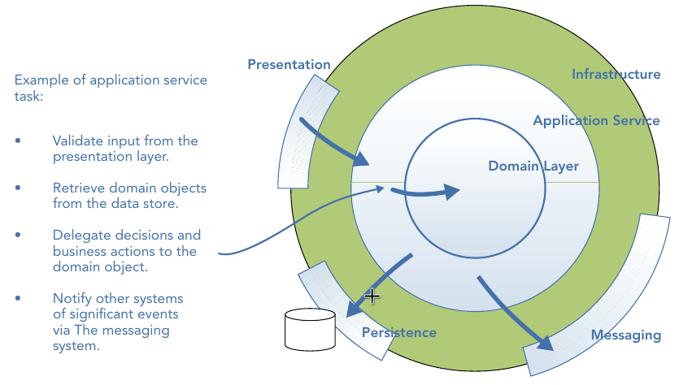

### Defining and Exposing Capabilities

- New clients should adapt to the API of the application services
- Capabilities of the system exposed by the application services

  - should not change for clients
  - should change only when the business use case changes

- The business tasks that the application layer is responsible for are meaningful to the business should be understood by the stakeholders

### Business Use Case Coordination

- The application services are procedural, as they are focused on task orchestration as opposed to modeling domain logic and concepts
- Application services are somewhat similar to MVC controller actions.

### Application Services Represent Use Cases, Not CRUD

Application services are not simply create, read, update, and delete (CRUD) methods; they should **reveal user intent and communicate the capabilities of a system**

### Domain Layer As an Implementation Detail

- for simply CRUD use cases: employ a tx script or data wrapper pattern to build domain models without logic
- for the application services and system behaviors rich in language: employ the domain model pattern

### Domain Reporting

- The application service layer needs to provide information on the state of domain objects in the form of reports
- The application services transform domain objects into presentation models that give specific views of domain state without revealing the structure of the domain model

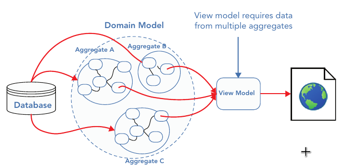

### Read Models versus Transactional Models

- It would be inefficient and costly for the application service to hydrate all the rich domain objects to simply provide a subset of information for a view
- The application service layer should provide a specific view of domain state directly from the data source

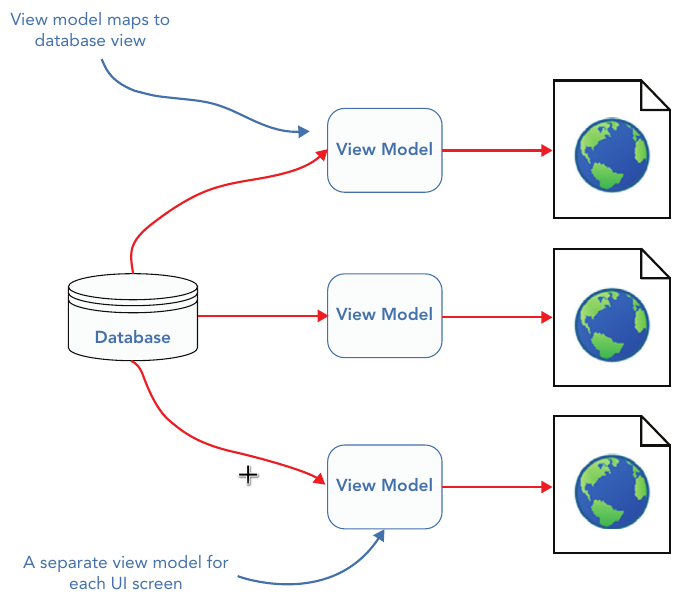

- The transactional model stores logic in domain objects and simple state in the data store
- To prevent the model from having to change because of presentation needs, you can **store the view data separately in a data schema** that is best suited to querying

  - store changes that occur within the domain model and use these as the basis for reporting requirements

- Example: the transactional model handles a write request from a client and then raises events that are stored for querying

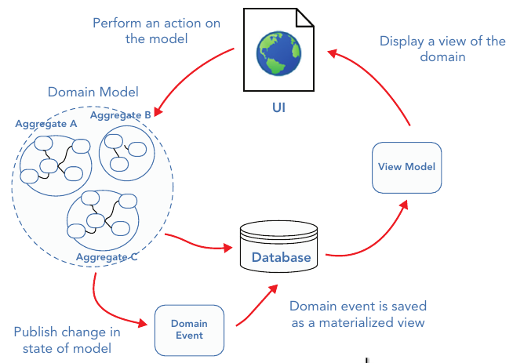

## APPLICATION CLIENTS

- Application services
  - should not bend to meet the needs of a client
  - should expose use cases of an application and force a client to adapt to its API
- It is entirely possible to build a system without an application service layer, relying on the clients to perform all the tasks that the application service layer is responsible for
- Example: multiple clients consume the behaviors of an application via the application service layer

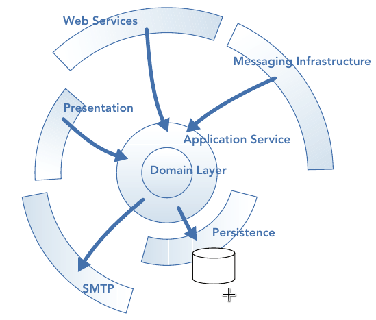

- Example: various clients work together to define a larger system

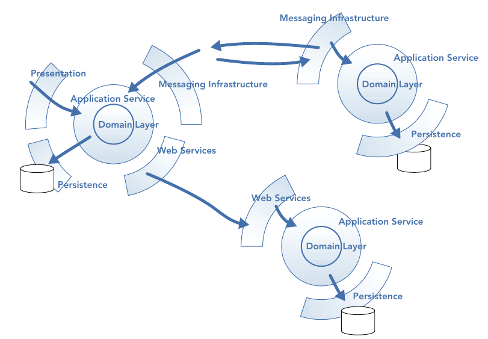

- Example: a process manager to coordinate tasks among business processes spanning multiple bounded contexts

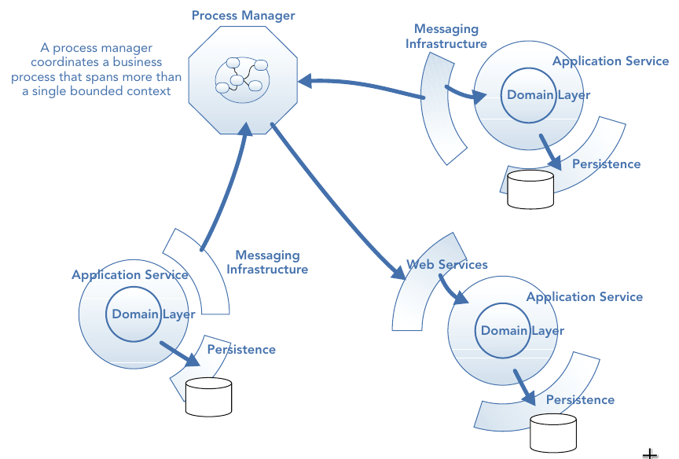
